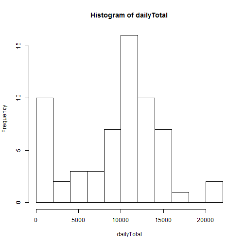
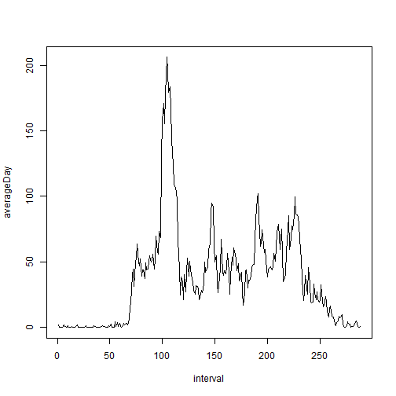
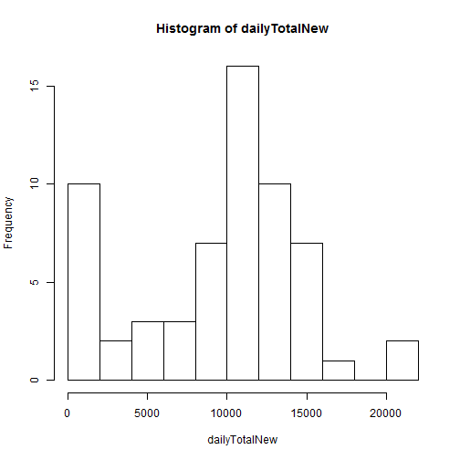
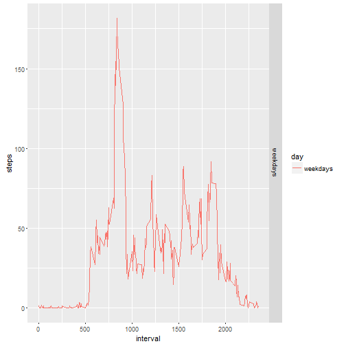

## Reproducible Research ##
# Course Project 1 #


###Loading and preprocessing the data###

This code loads the data

```r
data<-read.csv("activity.csv")
```

```
## Warning in file(file, "rt"): cannot open file 'activity.csv': No such file
## or directory
```

```
## Error in file(file, "rt"): cannot open the connection
```

```r
data$date<-as.character(data$date)
```

###What is mean total number of steps taken per day?###
####1. Calculating mean total number of steps taken per day####

This code calculates total number of steps taken on each day

```r
dailyTotal<-sapply(split(data$steps,data$date),function(x){sum(x,na.rm=1)})
dailyTotal
```

```
## 2012-10-01 2012-10-02 2012-10-03 2012-10-04 2012-10-05 2012-10-06 
##          0        126      11352      12116      13294      15420 
## 2012-10-07 2012-10-08 2012-10-09 2012-10-10 2012-10-11 2012-10-12 
##      11015          0      12811       9900      10304      17382 
## 2012-10-13 2012-10-14 2012-10-15 2012-10-16 2012-10-17 2012-10-18 
##      12426      15098      10139      15084      13452      10056 
## 2012-10-19 2012-10-20 2012-10-21 2012-10-22 2012-10-23 2012-10-24 
##      11829      10395       8821      13460       8918       8355 
## 2012-10-25 2012-10-26 2012-10-27 2012-10-28 2012-10-29 2012-10-30 
##       2492       6778      10119      11458       5018       9819 
## 2012-10-31 2012-11-01 2012-11-02 2012-11-03 2012-11-04 2012-11-05 
##      15414          0      10600      10571          0      10439 
## 2012-11-06 2012-11-07 2012-11-08 2012-11-09 2012-11-10 2012-11-11 
##       8334      12883       3219          0          0      12608 
## 2012-11-12 2012-11-13 2012-11-14 2012-11-15 2012-11-16 2012-11-17 
##      10765       7336          0         41       5441      14339 
## 2012-11-18 2012-11-19 2012-11-20 2012-11-21 2012-11-22 2012-11-23 
##      15110       8841       4472      12787      20427      21194 
## 2012-11-24 2012-11-25 2012-11-26 2012-11-27 2012-11-28 2012-11-29 
##      14478      11834      11162      13646      10183       7047 
## 2012-11-30 
##          0
```
####2. Histogram of the total number of steps taken each day####

Plot a histogram

```r
hist(dailyTotal,10)
```


####3. The mean and median of the total number of steps taken per day####

Calculating the mean and median. I ignore days with zero steps (NA values)

```r
theMean<-mean(dailyTotal[dailyTotal!=0])
theMedian<-median(dailyTotal[dailyTotal!=0])
```
The mean is 10766 steps per day
The median is 10765 steps per day

###What is the average daily activity pattern?###
####1. A time series plot of the 5-minute interval and the average number of steps taken, averaged across all days####

This code calculates average day activity and make a time series plot

```r
averageDay<-sapply(split(data$steps,data$interval),function(x){mean(x,na.rm=1)})
plot(averageDay,type="l",xlab="interval")
```



###2. Which 5-minute interval, on average across all the days in the dataset, contains the maximum number of steps?###

The code for calculating the most active 5 minute interval on average day

```r
theMostActiveInterval<-names(which.max(averageDay))
```
Interval 835 contains the maximum number of steps on average day


###Imputing missing values###
####1. Calculate and report the total number of missing values in the dataset####
Calculating code:


```r
NAnums<-sum(is.na(data$steps))
```

There are 2304 missing values in dataset

####2. A strategy for filling in all of the missing values in the dataset###

We have seen an expected and natural dynamics of daily activities, so I decided to use median number of steps on each interval

```r
medianInt<-sapply(split(data$steps,data$interval),function(x){median(x,na.rm=1)})
```

####3. Creating  a new dataset with the missing data filled in####

```r
newdata<-data
use<-is.na(data$steps)
newdata$steps[use]<-medianInt[match(data$interval[use],names(medianInt))]
```

####4. Histogram and daily mean/median for the new data####

```r
dailyTotalNew<-sapply(split(newdata$steps,newdata$date),function(x){sum(x)})
hist(dailyTotalNew,10)
```



```r
theNewMean<-mean(dailyTotalNew)
theNewMedian<-median(dailyTotalNew)
```
The new mean/median is 9504/10395 steps per day
Histogram looks almost the same, but the mean and the median are less than the earlier estimates because there are many NA's at the night time which mean that there were actualy no steps done

###Are there differences in activity patterns between weekdays and weekends?###

Calculating weekday and creating new factor for weekdays/weekends

```r
newdata$weekday<-weekdays(as.Date(newdata$date),abbreviate=TRUE)
use<-newdata$weekday%in%c("Сб","Вс")
newdata$day<-"weekdays"
newdata$day[use]<-"weekends"
averagedData<-aggregate(steps~interval+day,data=newdata,mean)
library(ggplot2)
ggplot(averagedData,aes(interval,steps))+geom_line(aes(color=day))+facet_grid(day~.)
```


As we can see at the workdays there are more activities in the morning and less activities in the afternoon
